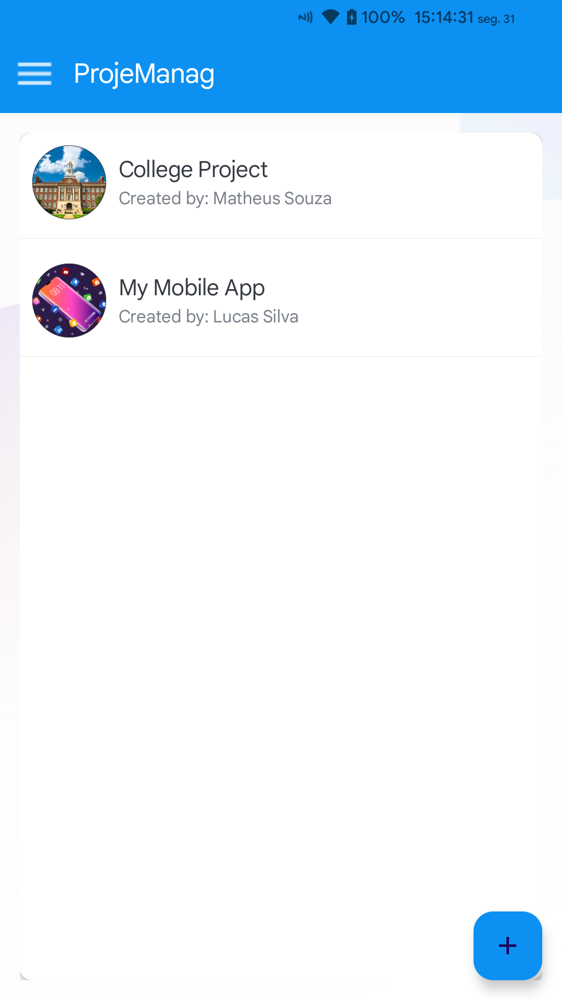

# HappyPlacesApp
Project Management Android app

## Objective
Manage your projects, creating task list, cards and assign members

## Functionalities
- Sign Up
- Sign In
- Edit my profile
- Create boards
- Create, update and delete task list
- Create, update and delete cards
- Assign members to boards
- Assign members to cards
- Drag and drop cards of task list

## Languages
- Kotlin 
- XML

## Frameworks
- Google Firebase (Authentication, FireStore, Storage)
- Glide (Image)

## Screenshots
#### Intro Screens
    

#### Home and My Profile
   

#### Board Details
       

#### Card Details
    

#### Filled Board Details
   
